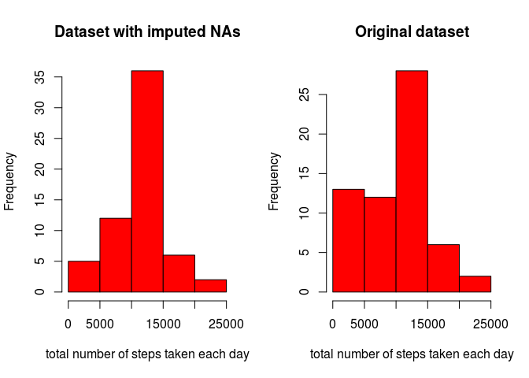
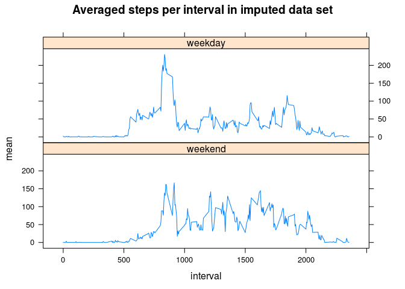

# Reproducible research. Week 01. Assingment: Course project 1

This assignment makes use of data from a personal activity monitoring device. This device collects data at 5 minute intervals through out the day. The data consists of two months of data from an anonymous individual collected during the months of October and November, 2012 and include the number of steps taken in 5 minute intervals each day.

The following script assumes that the work directory in R contains the uncompressed data set "activity.csv".

We will use the R package `dplyr` to summarize the data, and we'll use the `lattice` package to generate the last plot:

```r
library("dplyr")
```

```
## 
## Attaching package: 'dplyr'
```

```
## The following objects are masked from 'package:stats':
## 
##     filter, lag
```

```
## The following objects are masked from 'package:base':
## 
##     intersect, setdiff, setequal, union
```

```r
library("lattice")
```

First we read the data and we assign it to the data frame `my_data`: 


```r
my_data<-read.table("activity.csv",sep=",",header=T,stringsAsFactors = F)
```

We will convert the `my_data$date` column (i.e., the date on which the measurement was taken in YYYY-MM-DD format) into class `Date`:


```r
my_data$date<-as.Date(my_data$date,format="%Y-%m-%d")
```

Now we are going to create the histogram of the total number of steps taken each day. First we will need to sumnmarize the data by day:


```r
my_data_grouped_by_day<-group_by(my_data,date)
```

Then we will calculate the sum of steps taken each day and we'll assign it to a new data frame `my_data_grouped_by_day_summary':


```r
my_data_grouped_by_day_summary<-summarize(my_data_grouped_by_day,sum=sum(steps,na.rm=T))
```

Now we will create the actual histogram of the total number of steps taken each day:


```r
hist(my_data_grouped_by_day_summary$sum,col="red",xlab="total number of steps taken each day",main="histogram of total number of steps taken each day")
```


Now we will calculate the mean and median number of steps taken each day:


```r
mean(my_data_grouped_by_day_summary$sum)
```

```
## [1] 9354.23
```

```r
median(my_data_grouped_by_day_summary$sum)
```

```
## [1] 10395
```
Now we will make a time series plot of the 5-minute interval  and the average number of steps taken, averaged across all days. First we must group `my_data` by `my_data$interval`:


```r
my_data_grouped_by_interval<-group_by(my_data,interval)
```
Then we summarize the data:


```r
my_data_grouped_by_interval_summary<-summarize(my_data_grouped_by_interval,mean=mean(steps,na.rm=T))
```
Then, we create the plot:


```r
with(my_data_grouped_by_interval_summary,plot(interval,mean,type="l"))
```


Which 5-minute interval, on average across all the days in the dataset, contains the maximum number of steps?


```r
my_data_grouped_by_interval_summary[my_data_grouped_by_interval_summary$mean==max(my_data_grouped_by_interval_summary$mean),1]
```

```
## Source: local data frame [1 x 1]
## 
##   interval
##      (int)
## 1      835
```

Now we will impute the missing data. First we will calculate and report the total number of missing values in the dataset (i.e. the total number of rows with NAs):


```r
my_fun01 <-function (x) sum(is.na(x))
apply(my_data,2,my_fun01)
```

```
##    steps     date interval 
##     2304        0        0
```

Based on these results, NAs are only in column `my_data$steps`.

Our strategy for dealing with NA sin the `my_data$steps` column will be to replace them with the mean steps for the correponding interval across all the days, as calculated in `my_data_grouped_by_interval_summary`.
First we'll create a new data frame `my_new_data`, which initially a copy of `my_data`. Next, we'll loop though `my_new_data$steps`. If the value is NA, then we'll look up the mean steps for that interval across all dates (as calculated in `my_data_grouped_by_interval_summary`), and we'll replace the NA value with the new one. 


```r
my_new_data<-my_data
my_data_grouped_by_interval_summary<-data.frame(my_data_grouped_by_interval_summary)
for (i in 1:length(my_new_data$steps)){
if(is.na(my_new_data$steps[i])){
my_new_data$steps[i]<-my_data_grouped_by_interval_summary[my_data_grouped_by_interval_summary$interval==my_new_data[i,3],2]
}
}
```
Now we verify that there are no more NA s:


```r
apply(my_new_data,2,my_fun01)
```

```
##    steps     date interval 
##        0        0        0
```

Now we'll make a histogram of the total number of steps taken each day.First we will need to sumnmarize the data by day:


```r
my_new_data_grouped_by_day<-group_by(my_new_data,date)
```
Then we will calculate the sum of steps taken each day and we'll assign it to a new data frame `my_new_data_grouped_by_day_summary':


```r
my_new_data_grouped_by_day_summary<-summarize(my_new_data_grouped_by_day,sum=sum(steps))
```

Now we will create the actual histogram of the total number of steps taken each day:


```r
par(mfrow=c(1,2))
hist(my_new_data_grouped_by_day_summary$sum,col="red",xlab="total number of steps taken each day",main="Dataset with imputed NAs")
hist(my_data_grouped_by_day_summary$sum,col="red",xlab="total number of steps taken each day",main="Original dataset")
```


Now we will calculate the mean and median number of steps taken each day in the dataset with imputed NA s:


```r
mean(my_new_data_grouped_by_day_summary$sum)
```

```
## [1] 10766.19
```

```r
median(my_new_data_grouped_by_day_summary$sum)
```

```
## [1] 10766.19
```

And now we compare with the original dataset:


```r
mean(my_data_grouped_by_day_summary$sum)
```

```
## [1] 9354.23
```

```r
median(my_data_grouped_by_day_summary$sum)
```

```
## [1] 10395
```

These results show that the imputation of NA s with the mean of the interval leads to an increase in the mean and median daily steps.

Now we will study the differences in steps between weekdays and weekend. First we create a factor variable `my_new_data$week`: 


```r
my_weekdays<-c("Monday","Tuesday","Wednesday","Thursday","Friday")
my_new_data$week<-factor(weekdays(my_new_data$date) %in% my_weekdays,levels=c(F,T),labels=c('weekend', 'weekday') )
```

Then we group by `my_new_data$week` and by `my_new_data$interval`


```r
my_new_data_grouped_interval_week<-group_by(my_new_data,week,interval)
```

and we summarize the data:


```r
my_new_data_grouped_interval_week_summary<-summarize(my_new_data_grouped_interval_week,mean=mean(steps))
```

Then, we create the plot:


```r
with(my_new_data_grouped_interval_week_summary,xyplot(mean~interval|week,type="l",layout=c(1,2),main="Averaged steps per interval in imputed data set"))
```


